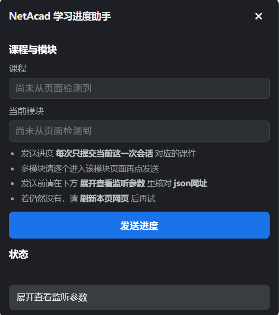

> **注：**
>
> 1. 本助手是用于提交给 **每一章节** 的进度，而在其中不能提交 **题目 或 考试** 的答案。如果想获取 **题目 或 考试** 的答案，请去这个项目 [思科网习题答案获取](https://github.com/MilLoong/netacad-answer-helper/tree/master)
> 2. **不能保证** 每个章节都能正常发送，所以如果出现发送失败可能是真的不能发送
> 3. 每次发送都会 **覆盖进度**，请慎重操作

# NetAcad 学习进度助手（浏览器扩展）

适用于 **Chrome / Edge**。用于在思科网络学院学习网站 **`*.netacad.com`** 上，查看当前学习页的 **会话与课件是否就绪**，然后可 **把本页对应的进度发到服务器**，以 **简化学习进度**。扩展会在后台记下近期页面请求中的必要参数，仅在当前页确实进入过学习内容时再显示有效信息。

## 功能概要

- **右下角 "发"**：点开后可查看当前 **课程简称、模块、课件数据是否就绪、学习会话是否正常**，并在此处 **发送进度**。
  - **只有当你正在看具体学习内容时** 才可能显示这个小圆钮。例如在 **只做总览、没打开某一节学习内容** 的页面，一般不会显示，免得挡视线。
  - 若 **本页还没有形成一次完整的学习会话**（刚到页面或未加载完），面板里不会出现 "看起来像上一节课的假数据"，避免误导。

- **浏览器工具栏上的扩展图标**：打开小窗口，同样可以 **刷新状态** 和 **发送进度**，不必一定要先点 "发"。

安装或更新本扩展后，请 **刷新** 正在使用的学习网站标签页。若仍然没有数据或不正常，可先 **刷新当前网页** 再试。

## 安装（Chrome / Edge）

1. 打开 **扩展程序**：`chrome://extensions/` 或 `edge://extensions/`  
2. 开启右上角 **开发者模式**  
3. 点击 **加载已解压的扩展程序**，选中本文件夹（里面应有 `manifest.json`）

## 使用

1. 请先 **正常打开并完成一小段课件加载**，再点开 **"发"** 或扩展弹窗，看是否出现类似 **课件数据就绪**、**学习会话正常** 的提示。  

   

2. **每点一次发送**，一般只提交 **你现在这一小段学习里对应的那份课件进度**；如果一门课里有多个章节要分别报送，请 **分别进入对应章节所在的页面**，再逐个发送。  

   

3. 发送前可在 **展开查看监听参数** 里核对 **一串 json 开头的网址** 是否和眼下正在学的这一节相符。
